# SEU_exercise

是否因为小程序总是出现故障而导致无法保存锻炼记录？还是因为校园网络环境较差让你总是卡在加载界面？那么，这款程序将完美解决这些问题！SEU_exercise可以直接将运动数据上传至服务器，无需通过官方小程序！

## 使用教程

### 下载本程序

#### 方法1

请前往[发布页](https://github.com/el739/SEU_exercise/releases)下载本程序。

#### 方法2

或者，如果你有Python运行时，可以直接克隆本项目

```bash
git clone https://github.com/el739/SEU_exercise.git
cd SEU_exercise
```

安装所需依赖并运行

```bash
pip3 install -r requirements.txt
python3 main.py
```

### 安装并运行Cheat Engine

1. 访问[Cheat Engine](https://www.cheatengine.org/)官网，下载并安装Cheat Engine。
2. 双击打开软件，跳过教程，进入主界面。
   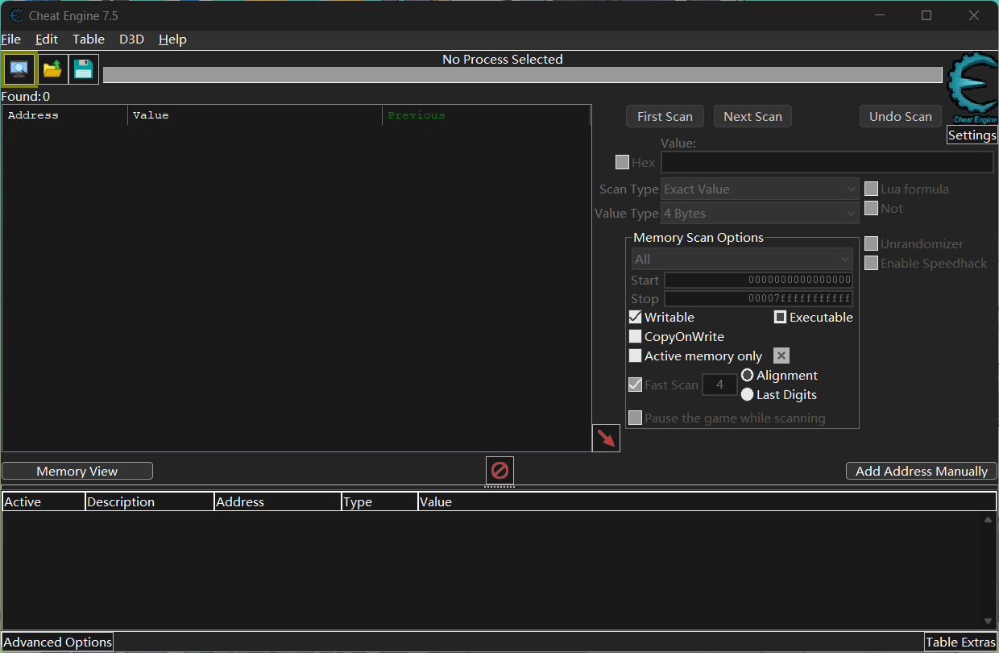

### 运行官方小程序

1. 打开电脑端微信，运行小程序“东南大学体育管理”并登录自己的账号。
2. 进入“锻炼”界面。
   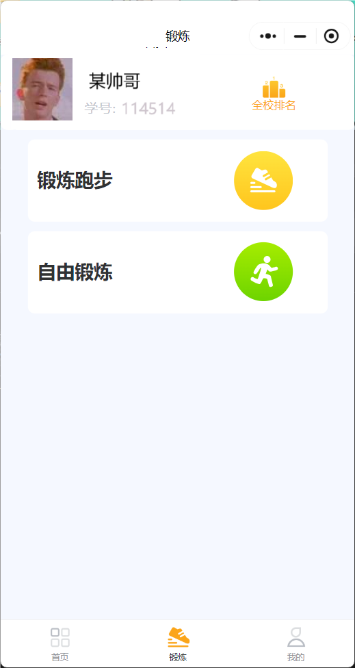

### 用Cheat Engine打开发现小程序

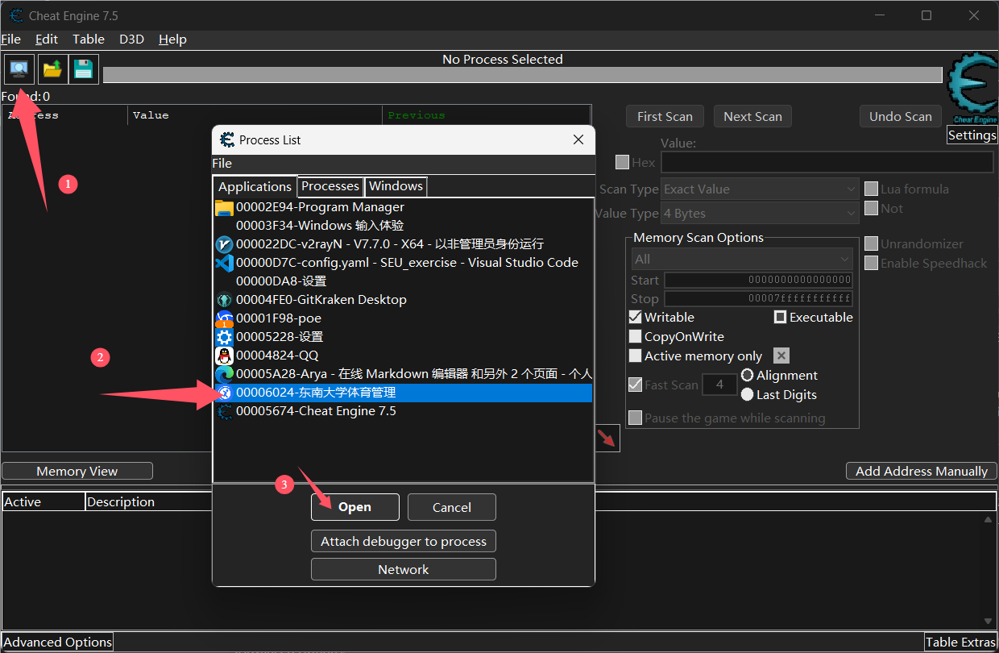

### 搜索并配置必要字段

首先，由于我们关注的信息（如登录凭证、个人ID等）以字符串形式存储，因此需将搜索目标改为字符串。

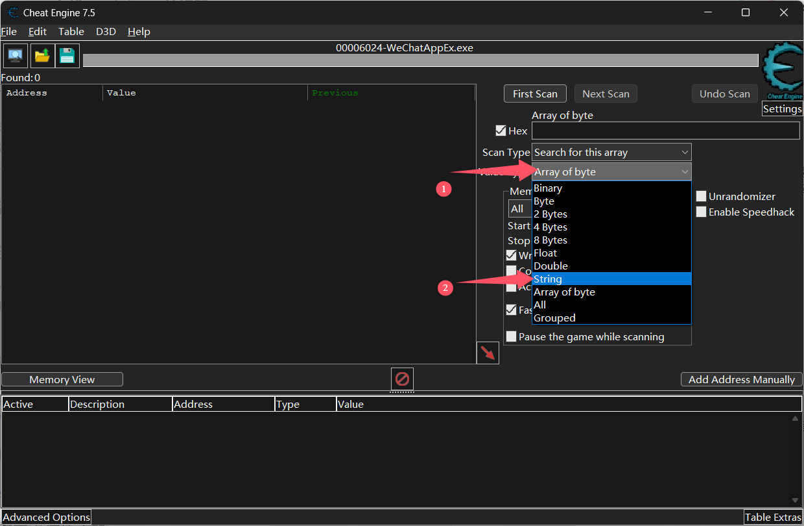

#### 获取自己的token

token是最重要的登录凭证，由一串长长的数字、字母和符号组成。
在搜索框中输入`Bearer `（注意末尾有一个空格），然后点击`First scan`。
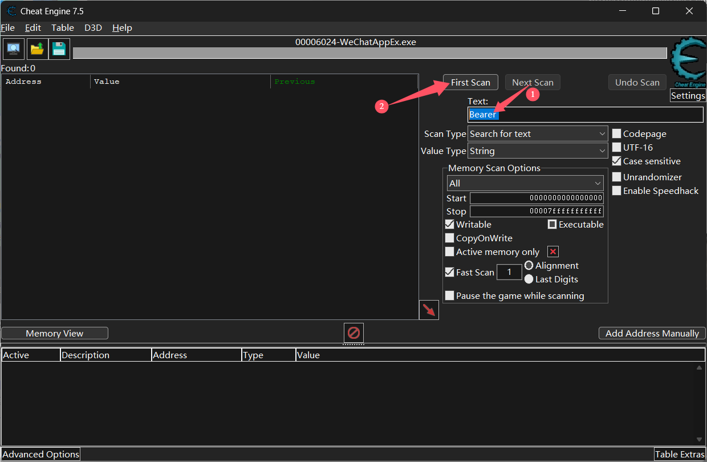

在结果中会出现多个条目。点击第一个结果，并同时按下Ctrl+B，可以弹出一个新窗口。
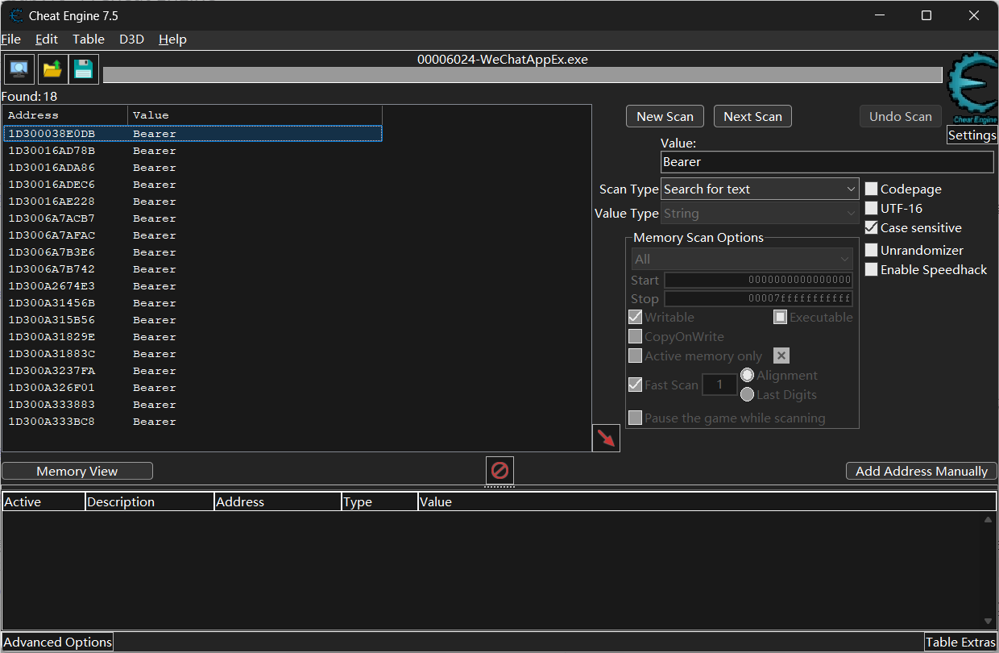
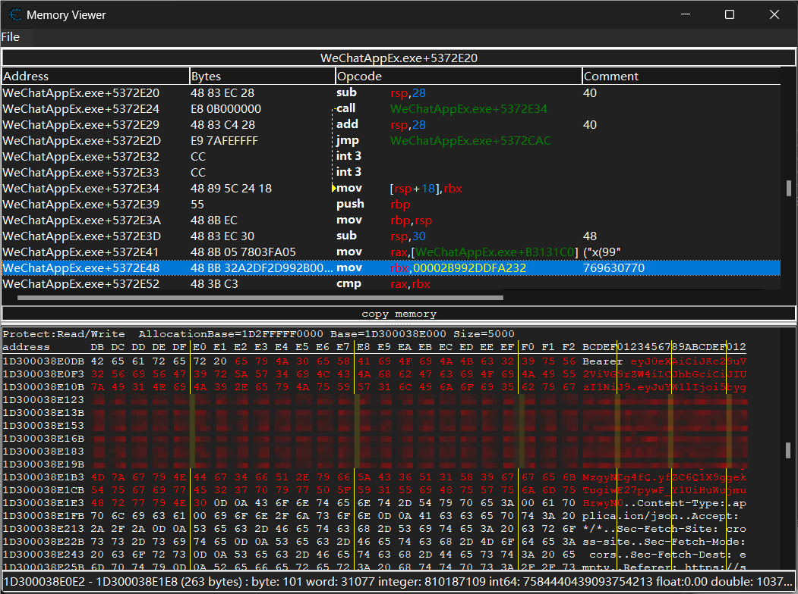

此时，`Bearer `后面的部分（即图片中标红的部分，`eyJ0eXAiOiJKc2.....HrwyN0`）就是你需要的token。选中它并按Ctrl+C复制。
接着，用记事本打开`config.yaml`，将token粘贴到对应字段中（记得加上双引号）。
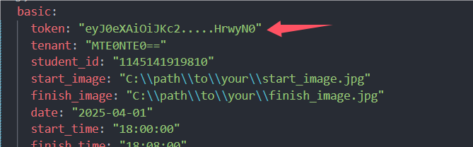

*注：如果未能找到一串无规则字符串，请使用相同的方法查看第二个、第三个地址，直到找到token。如果所有地址均没有，则尝试打开小程序的其他页面，重复以上步骤。*

#### 获取自己的tenant

成功获取token后，保持Memory_viewer对话框的打开状态，稍微向上滚动地址区域，可以找到自己的tenant值。
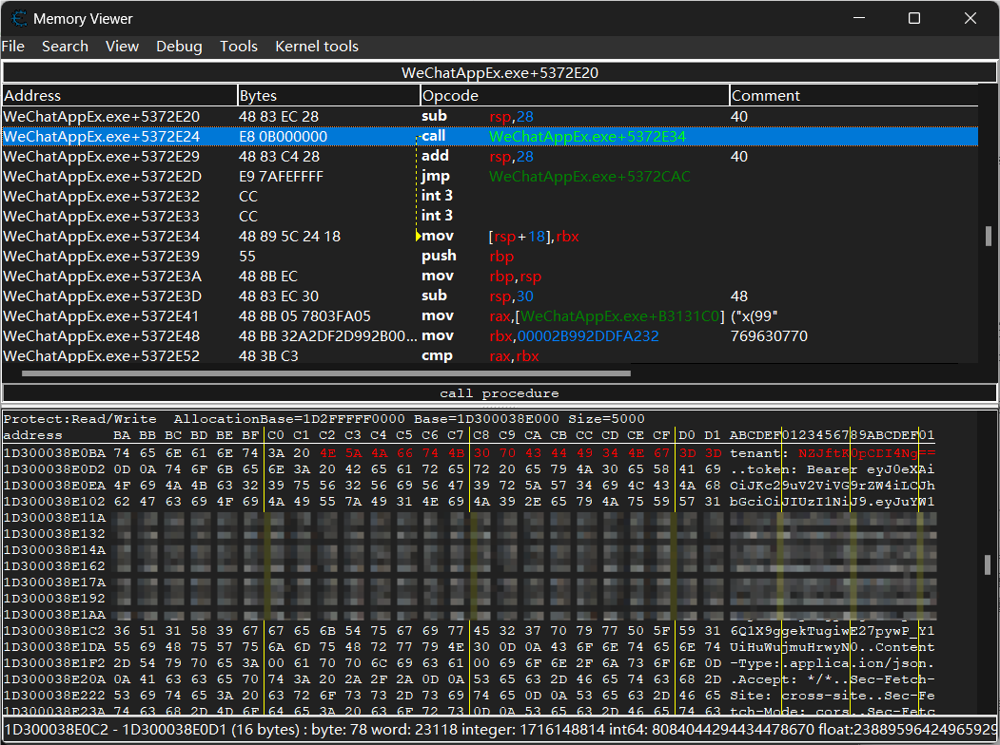

在`config.yaml`中填写tenant值。
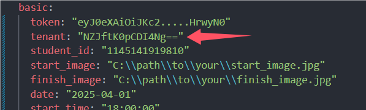

#### 获取自己的id

与获取token时类似，在输入框中输入`"data":"{\"id\":\"`并进行搜索。
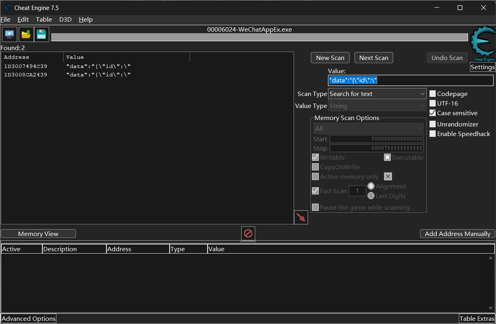

单击得到的地址，按Ctrl+B，即可找到你的id。
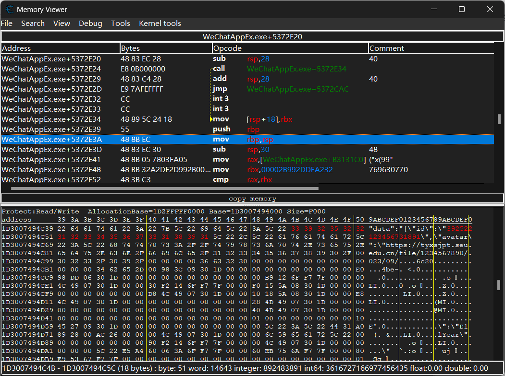

将其粘贴到config.yaml的对应字段中。
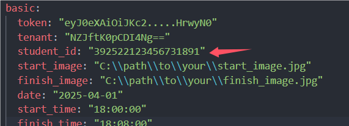

至此，繁琐的凭证获取过程结束了，可以关闭Cheat Engine，接下来可以配置其他选项。

### 配置跑步信息

各项目的作用已在.yaml文件中说明，此处不再赘述。
**注意：`.yaml`文件较为敏感，各种空格都起到关键作用。因此，在编辑时，避免删除双引号，而应在双引号内修改，以确保能被正确识别。**
若正常配置完成，编辑器支持时，应会有高亮显示。

```yaml
basic:
  token: "eyJ0eXAiOiJKc2.....HrwyN0"
  tenant: "NZJftK0pCDI4Ng=="
  student_id: "392522123456731891"
  start_image: "C:\\path\\to\\your\\start_image.jpg" # 指定锻炼开始的照片路径，建议大小控制在200KB以内（约200x600）。注意，使用Windows默认反斜杠需进行转义。
  finish_image: "C:\\path\\to\\your\\finish_image.jpg" # 指定锻炼结束的照片路径，规则同上。
  date: "2025-04-01" # 锻炼日期
  start_time: "18:00:00" # 锻炼开始时间
  finish_time: "18:08:00" # 锻炼结束时间
  seconds: "480" # 停止的秒数，避免与锻炼的开始时间和结束时间发生冲突。
  distance: "1.24" # 锻炼距离（单位：公里）
  calorie: "77" # 消耗的卡路里
  speed: "6'52''" # 配速，不清楚格式时，建议不要修改
  display_time: "00:08:00" # 界面显示时间

advanced:
  baseUrl: "tyxsjpt.seu.edu.cn"
  miniappversion: "minappv3.0.1"
  UA: "Mozilla/5.0 (Linux; Android 7.1.2; V2284A Build/N2G47H; wv) AppleWebKit/537.36 (KHTML, like Gecko) Version/4.0 Chrome/116.0.0.0 Mobile Safari/537.36 XWEB/1160253 MMWEBSDK/20240301 MMWEBID/4107 MicroMessenger/8.0.48.2580(0x28003036) WeChat/arm64 Weixin NetType/WIFI Language/zh_CN ABI/arm64 MiniProgramEnv/android"
  rule_id: "402186368309502988"
  plan_id: "403640124545491473"
  route_name: "桃园田径场"
  route_rule: "九龙湖校区"
```

### 运行主程序

在终端中运行`main.exe`或直接运行源代码，根据提示进行操作。当出现`Record added successfully`时，即表示成功上传一次记录。
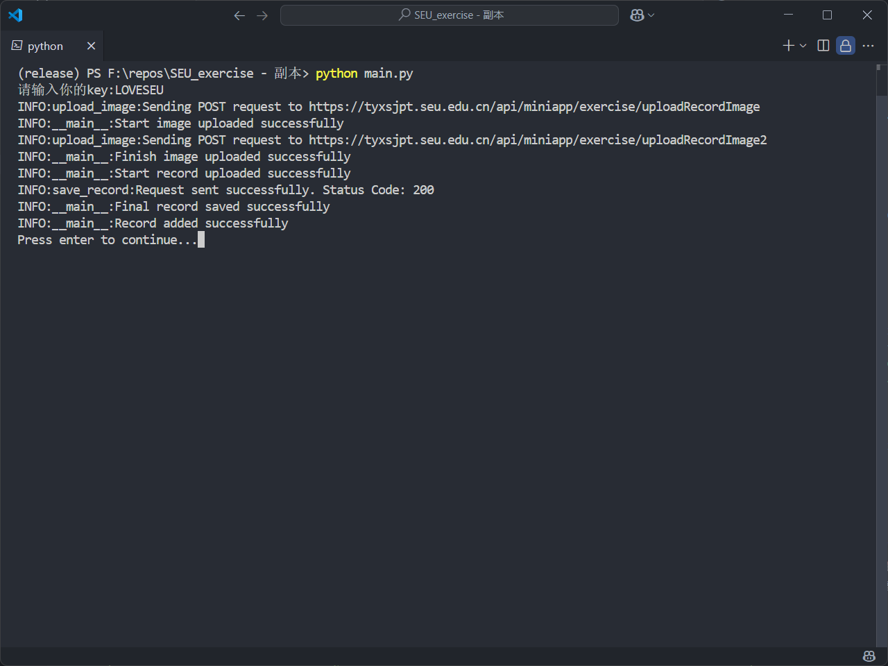

## 故障排查

程序运行日志将保存在与程序同目录下的app.log文件中，如程序报错并退出可在此文件中查看记录。项目初期错误处理尚不完善，希望大家能够提交issue帮助我们改进！

## 获取运行程序所需的key

目前使用key`LOVESEU`即可激活本程序（限前1000次使用）。

## 免责声明

本程序旨在为用户提供方便的锻炼记录上传功能，以促进健康意识和锻炼习惯的养成。然而，使用本程序的用户须注意以下几点：

1. **记录真实性**：本程序不对用户上传的锻炼记录的真实性与准确性负责。所有用户应对其所提交的记录负责，确保所提供的信息真实、准确，严禁任何形式的伪造或篡改。
2. **数据使用**：本程序收集的锻炼记录仅用于学校内部活动及相关统计分析，不会用于其他任何商业用途。
3. **后果自负**：用户因使用本程序而导致的任何直接或间接的损失、争议、法律责任等后果，均由用户自行承担。我们不对因用户的不当使用所引发的任何法律问题或后果负责。
4. **使用条款**：通过使用本程序，用户即表示同意遵守上述条款，并理解相关责任。我们保留随时修改本免责声明的权利，修改后的免责声明将在本程序中发布。

感谢您对本程序的支持与使用！希望您能够诚实记录锻炼信息，共同营造积极健康的校园氛围。
