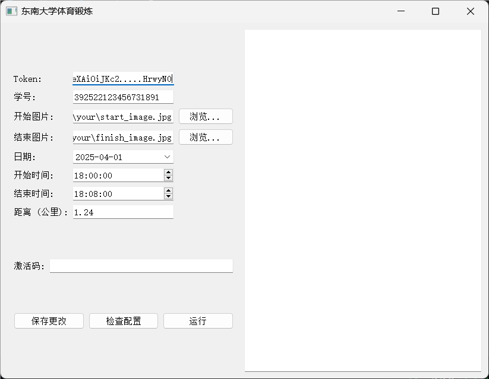
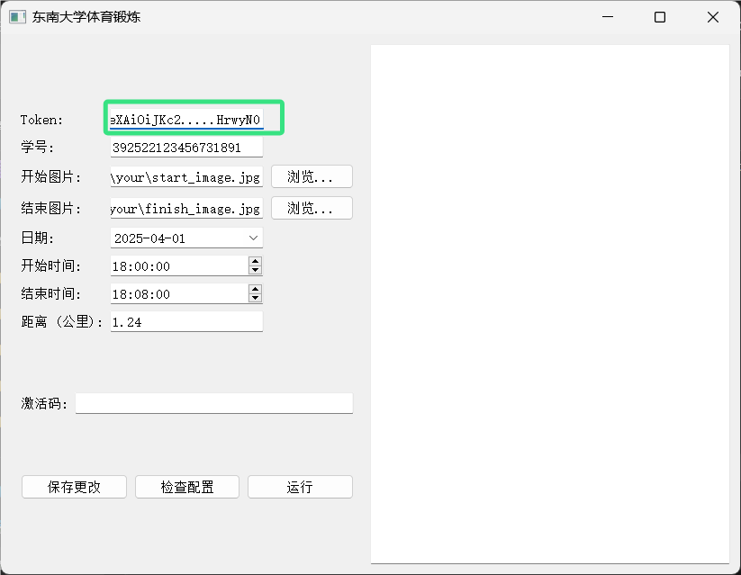
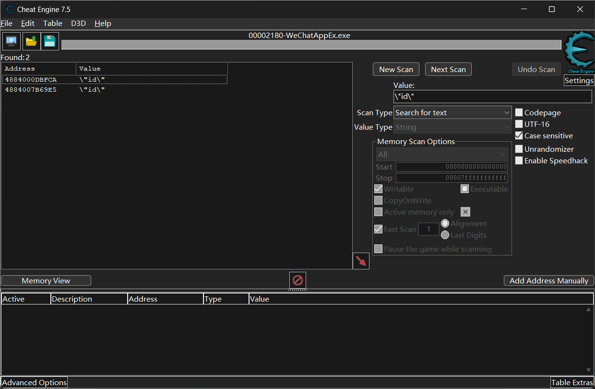
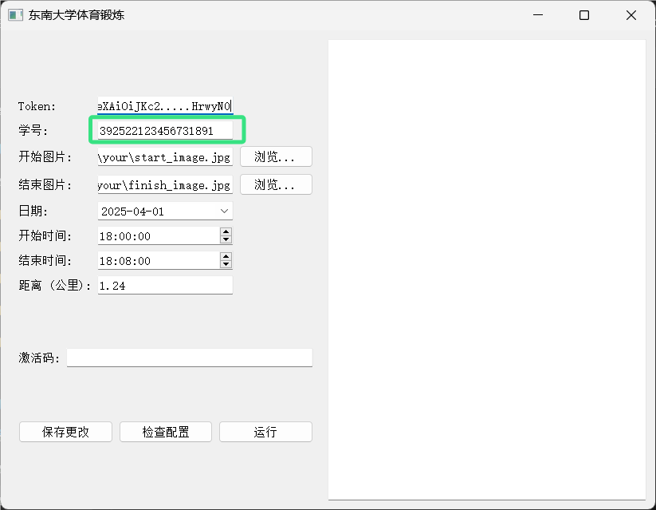
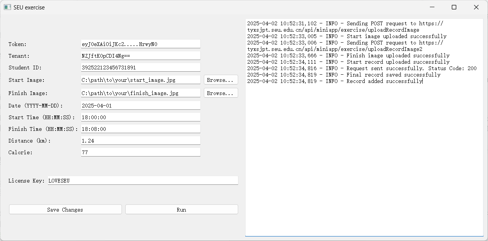
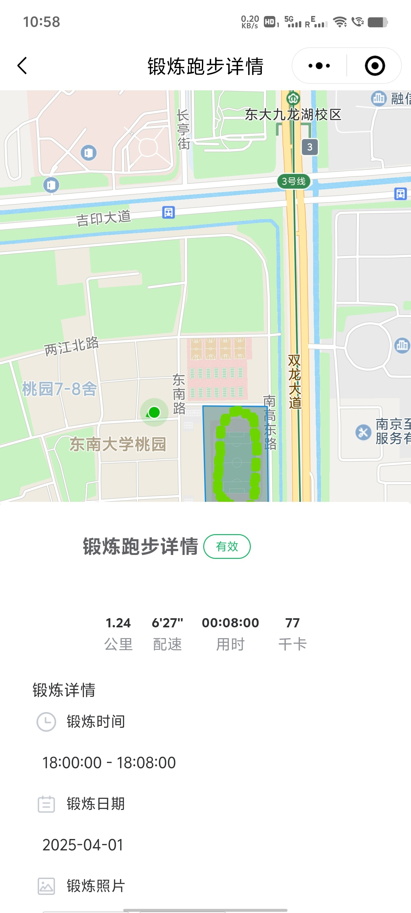

# SEU_exercise

是否因为小程序总是出现故障而导致无法保存锻炼记录？还是因为校园网络环境较差让你总是卡在加载界面？那么，这款程序将完美解决这些问题！SEU_exercise可以直接将运动数据上传至服务器，无需通过官方小程序！

## 使用教程

### 下载本程序

#### 方法1

请前往[发布页](https://github.com/el739/SEU_exercise/releases)下载本程序。

#### 方法2

或者，如果你有Python运行时，可以直接克隆本项目

```bash
git clone https://github.com/el739/SEU_exercise.git
cd SEU_exercise
```

安装所需依赖并运行

```bash
pip3 install -r requirements.txt
python3 run.py
```

### 

若运行成功，界面应当如图所示


### 安装并运行Cheat Engine

1. 访问[Cheat Engine](https://www.cheatengine.org/)官网，下载并安装Cheat Engine。
2. 双击打开软件，跳过教程，进入主界面。
   

### 运行官方小程序

1. 打开电脑端微信，运行小程序“东南大学体育管理”并登录自己的账号。
2. 进入“锻炼”界面。


### 用Cheat Engine打开小程序


### 搜索并配置必要字段

首先，由于我们关注的信息（如登录凭证、个人ID等）以字符串形式存储，因此需将搜索目标改为字符串。


#### 获取自己的token

token是最重要的登录凭证，由一串长长的数字、字母和符号组成。
在搜索框中输入`Bearer `（注意末尾有一个空格），然后点击`First scan`。


在结果中会出现多个条目。点击第一个结果，然后按下Ctrl+B，可以弹出一个新窗口。


此时，`Bearer `后面的部分（即图片中标红的部分，`eyJ0eXAiOiJKc2.....HrwyN0`）就是你需要的token。选中它并按Ctrl+C复制。
接着，将这串字符复制到本程序的token输入框中，如图。


*注：如果未能找到一串无规则字符串，请使用相同的方法查看第二个、第三个地址，直到找到token。如果所有地址均没有，则尝试打开小程序的其他页面，重复以上步骤。*

#### 获取自己的tenant

成功获取token后，保持Memory_viewer对话框的打开状态，稍微向上滚动地址区域，可以找到自己的tenant值。


同上，在主程序中填入tenant值。


#### 获取自己的id

与获取token时类似，在输入框中输入`"data":"{\"id\":\"`并进行搜索。


单击得到的地址，按Ctrl+B，即可找到你的id。


同上，在主程序中填入id值。


至此，繁琐的凭证获取过程结束了，可以关闭Cheat Engine，接下来可以配置其他选项。

### 配置跑步信息

本程序中，其他字段的作用分别如下：

| 字段名 | 说明 | 备注 |
| --- | --- | --- |
| Start Image | 希望官方小程序锻炼开始的照片 | 输入文件路径（无须转义）或点击`Browse`浏览本地文件 |
| Finish Image | 希望官方小程序锻炼结束的照片 | 同上 |
| Date | 锻炼日期 | 格式YYYY-MM-DD，例如`2025-04-01` |
| Start Time | 锻炼开始时间 | 格式HH:MM:SS，例如`18:00:00` |
| Finish Time | 锻炼结束时间 | 同上 |
| Distance | 锻炼距离 | 单位为km |
| Calorie | 本次消耗的卡路里 | 若无需求保持默认即可 |


### 运行主程序

先点击`Save Changes`将配置文件保存到本地（以便将来无须重新填写身份信息），然后填入你的 Licecse Key （目前可填入`LOVESEU`），单击`Run`，程序即开始运行，此时可在右侧观察到输出的日志记录。
当弹窗显示`Operation completed successfully!`或右侧日志区中输出`INFO - Record added successfully`时，即成功上传自己的运动记录。

此时可前往官方小程序查看上传结果。


## 故障排查

程序运行日志将实时输出在右侧的文本框中，如程序报错可在此查看记录。项目初期错误处理尚不完善，希望大家能够提交issue帮助我们改进！

## 获取运行程序所需的 License Key

目前使用 License Key`LOVESEU`即可激活本程序（限前1000次使用）。

## 免责声明

本程序旨在为用户提供方便的锻炼记录上传功能，以促进健康意识和锻炼习惯的养成。然而，使用本程序的用户须注意以下几点：

1. **记录真实性**：本程序不对用户上传的锻炼记录的真实性与准确性负责。所有用户应对其所提交的记录负责，确保所提供的信息真实、准确，严禁任何形式的伪造或篡改。
2. **数据使用**：本程序收集的锻炼记录仅用于学校内部活动及相关统计分析，不会用于其他任何商业用途。
3. **后果自负**：用户因使用本程序而导致的任何直接或间接的损失、争议、法律责任等后果，均由用户自行承担。我们不对因用户的不当使用所引发的任何法律问题或后果负责。
4. **使用条款**：通过使用本程序，用户即表示同意遵守上述条款，并理解相关责任。我们保留随时修改本免责声明的权利，修改后的免责声明将在本程序中发布。

感谢您对本程序的支持与使用！希望您能够诚实记录锻炼信息，共同营造积极健康的校园氛围。
