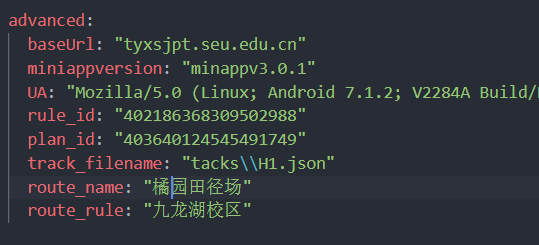

# 更改运动场地

上传数据时，有多个运动场地可以选择。这些配置需要手动修改config.yaml。

## 概述

要更改运动场地，需要同时更改几个字段：

* `rule_id`：要在哪个校区进行运动。例如，九龙湖校区
* `plan_id`：运动的路线是什么。例如，橘园田径场
* `track_filename`：与上面两项匹配的相应路线的文件

这些字段的值在下面的列表中给出

| 运动场地 | `rule_id` | `plan_id` | `track_filename` |
| --- | --- | --- | --- |
| 湖区橘园 | `402186368309502988` | `403640124545491749` | `tacks/H1.json` |
| 湖区桃园 | `402186368309502988` | `403640124545491473` | `tacks/H2.json` |
| 湖区梅园 | `402186368309502988` | `403640115955556355` | `tacks/H3.json` |
| 桥区体育场 | `403640128840458304` | `403640128840458306` | `tacks/Q.json` |
| 牌区田径场 | `403640128840458519` | `403640128840458727` | `tacks/P1.json` |
| 牌区体育场 | `403640128840458519` | `403640128840458521` | `tacks/P2.json` |
| 无锡国际校区 | `482716833313089537` | `405863869632939014` | `tacks/W.json` |

## 示例

若希望添加湖区橘园田径场的记录，则相应的`config.yaml`应当如下：

